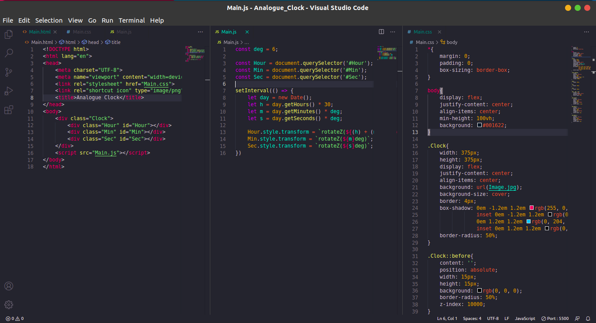
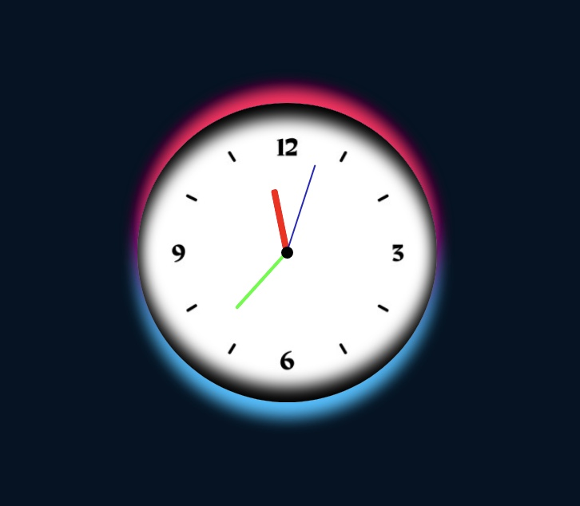

# Analogue_Clock
This is an Analogue Clock Website made using HTML, CSS, and JavaScript. It's very simple and easy to make and also note that it is fully responsive. You can find this Website by Clicking on this [Link](https://surya0705.github.io/Analogue_Clock/Main.html).

Below is the Screenshot of this Website:

And the below image show's you the working output of this Website:

Hope that you Liked it!
